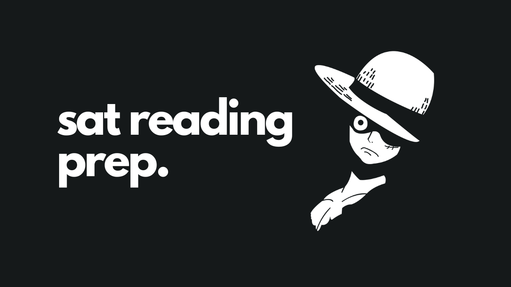

# SAT Reading Prep

Some materials that will help in preparing for the reading section of SAT.
ㅤㅤㅤㅤㅤㅤㅤㅤㅤ                        
!!!warning This guide was meant for the traditional SAT exam aka the one we have been giving until 2022. Since digital SAT is a thing now, I'm not sure what the new pattern is, but I'm sure these will definitely help improve your comprehension as well as overall English skill. So, regardless of which SAT you're taking these resources should prove themselves helpful.
!!!

## Suggested Reading
- New York Times: www.nytimes.com (particularly the Science section)
- Economist: www.economist.com
- Scientific American: www.scientificamerican.com
- National Geographic: www.nationalgeographic.com
- Newsweek: www.newsweek.com
- Time Magazine: www.time.com
- Smithsonian Magazine: www.smithsonianmag.com
- The Atlantic Monthly: www.theatlantic.com/magazine
- Wired: www.wired.com

**For links to many additional resources** 
- Arts & Letters Daily: www.aldaily.com

**Historical Documents, Sources:** 
- https://www.ushistory.org/documents/

**Also see:** Gerald Graff, Cathy Birkenstein, and Russell Durst: *Tiley Say/I Say: The Moves that
Matter in Academic Writing, 2nd Edition.* New York: W.W. Norton and Company, 2009.

**Fiction, suggested authors:** Julia Alvarez, Jane Austen, Charlotte/ Anne Bronte, Michael
Chabon, Charles Dickens, Jhumpa Lahiri, Toni Morrison, George Orwell, Edith Wharton

**Science and Social Science Authors:** Daniel Kahneman, Malcolm Gladwell, Adam Grant,
Daniel Levitin, Brian Greene, Stephen Hawking, Lisa Randall

!!!
*Note: If you are seeking additional resources for graphic-based questions, you may want to
work with Science sections from released ACTs. Although somewhat more challenging than
SAT data analysis questions overall, they nevertheless require many of the same skills tested
on the SAT. In addition to the tests in 77ze Official ACT Prep Guide, several more authentic
exams are available online.*
!!!

## Key Historical Movements and Figures:

- **The Revolutionary Period:** 

Benjamin Franklin, Thomas Jefferson, John Adams, Alexander Hamilton
- **The Abolitionist Movement:** 

Frederick Douglass, William Lloyd Garrison, Herny Ward Beecher, Harriet Beecher Stowe
- **Transcendentalism:** 

Ralph Waldo Emerson, Henry David Thoreau
- **The Civil War:**
 
 Abraham Lincoln, Stephen Douglass, Daniel Webster
- **The Women's Rights Movement:**
 
 Susan B. Anthony, Elizabeth Cady Stanton, Lucretia Mott,
Angelina and Sarah Grimke (also active in the Abolitionist Movement)
- **The Progressive Movement and Muckrakers:**
 
 Upton Sinclair, Jane Addams, Ida Tarbell,
Jacob Riis, WEB DuBois, Booker T. Washington
- **World Wars I and II:**
 
 Woodrow Wilson (WWI), Franklin D. Roosevelt (WWII)
- **The Civil Rights Movement:**
 
 Martin Luther King, Jr., Malcolm X, Fannie Lou Hamer, John F.
Kennedy

## Some Important Passage Readings:

=== 1. Structure of the Government (Democracy Vs. Older Forms) 
Example: Official SAT Test 4, Edmund Burke and Thomas Paine 
Suggested Readings: 
a) Edmund Burke: [Reflections on the Revolution in France](https://www.earlymoderntexts.com/assets/pdfs/burke1790part1.pdf)
b) Thomas Paine: [Common Sense](https://www.gutenberg.org/files/147/147-h/147-h.htm), 
[The Rights of Man](https://www.gutenberg.org/files/3742/3742-h/3742-h.htm), 
[Age of Reason](https://www.gutenberg.org/files/3743/3743-h/3743-h.htm) 
===

=== 2. Injustice (Slavery, racial/gender discrimination, economic suffering) + Response to injustice (new legislation, civil disobedience) 
Example: Official SAT Test 2, Elizabeth Cady Stanton and Official SAT Test 3, Mary Wollstonecraft
Suggested Readings: 
a) Elizabeth Stanton: [History of Woman Suffrage](https://www.gutenberg.org/files/28556/28556-h/28556-h.htm)
b) Mary Wollstonecraft: [A vindication of the rights of men, in a letter to the Right Honourable Edmund Burke](https://www.gutenberg.org/files/62757/62757-h/62757-h.htm)
c) Mary Wollstonecraft: [Maria The Wrongs of Woman](https://www.gutenberg.org/files/134/134-h/134-h.htm)
===

=== 3. Questions of Historical Progress and Reform. Rethink "Abolition of Slavery" or Women's Rights 
Example: Official SAT Test 1, Virginia Woolf + PSAT, Frederick Douglas 
Suggested Readings: 
a) Catherine Beecher: [An Essay on Slavery and Abolitionism](http://at.virginia.edu/38A5E6z)
b) Angelina Grimke: [Letters to Catherine E. Beecher](https://www.gutenberg.org/files/53852/53852-h/53852-h.htm)

===

=== 4. Political, Economic, Cultural, Moral Attributes of the US 
Example: Official SAT Test 6, Abe Lincoln and Henry David Thoreau
Suggested Readings: 
a) [Abe Lincoln Writings](http://bit.ly/3qe3gZ3)
b) Henry David Thoreau: [Civil Disobedience](http://bit.ly/3slL3KS)
c) Alexis de Tocqueville: [Democracy in America](http://bit.ly/35zzGFu)
===

=== 5. Founding Papers + Ideologies 
Example: Official SAT Test 8, Abe Lincoln and Stephen Douglas
Suggested Readings: 
a) Abe Lincoln
b) [The Declaration of Independence](http://bit.ly/2XyNhsl)
===

## Some books to read:

| Book                           | Author                | The Plot in 3 Words            | Book |
|--------------------------------|-----------------------|--------------------------------|------|
| Pride and Prejudice            | Jane Austin           | British romantic comedy        | 1797 |
| Wuthering Heights              | Emily Bronte          | Passionate love story          | 1847 |
| The Awakening                  | Kate Chopin           | Wife finds freedom             | 1899 |
| The Red Badge of Courage       | Stephen Crane         | Civil War fear                 | 1895 |
| Don Quixote                    | Miguel de Cervantes   | A madman’s adventure           | 1605 |
| The Three Musketeers           | Alexandre Dumas       | Historical French adventure    | 1844 |
| The Great Gatsby               | F. Scott Fitzgerald   | Rags to riches                 | 1925 |
| The Great Gatsby               | F. Scott Fitzgerald   | Rags to riches                 | 1925 |
| Lord of the Flies              | William Golding       | Deserted island boys           | 1954 |
| The Scarlet Letter             | Nathaniel Hawthorne   | Punishment for adultery        | 1850 |
| Catch-22                       | Joseph Heller         | WWII satire                    | 1961 |
| Brave New World                | Aldous Huxley         | Year 2540 utopia               | 1932 |
| The Metamorphosis              | Franz Kafka           | Man becomes insect             | 1915 |
| To Kill a Mockingbird          | Harper Lee            | Deep South prejudice           | 1960 |
| The Call of the Wild           | Jack London           | Yukon sled dog                 | 1903 |
| Beloved                        | Toni Morrison         | Effects of slavery             | 1987 |
| Animal Farm                    | George Orwell         | Farm animals revolt            | 1945 |
| The Bell Jar                   | Sylvia Plath          | Young woman’s depression       | 1963 |
| The Catcher in the Rye         | J.D. Salinger         | A teenager’s alienation        | 1951 |
| The Grapes of Wrath            | John Steinbeck        | Great Depression sharecroppers | 1939 |
| Treasure Island                | R.L. Stevenson        | High seas adventure            | 1883 |
| Uncle Tom’s Cabin              | Harriet Beecher Stowe | Cruelty of slavery             | 1852 |
| Adventures of Huckleberry Finn | Mark Twain            | A runaway’s story              | 1885 |
| Candide                        | Voltaire              | French adventure satire        | 1759 |
| Slaughterhouse-Five            | Kurt Vonnegut         | WWII time travel               | 1969 |
| The Color Purple               | Alice Walker          | Southern women’s difficulties  | 1982 |
| The Picture of Dorian Gray     | Oscar Wilde           | Price of vanity                | 1890 |
| Native Son                     | Richard Wright        | Depression-era racism          | 1940 |